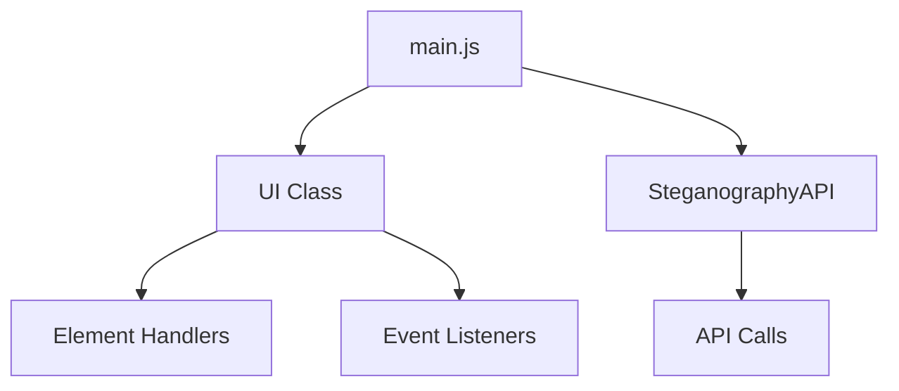
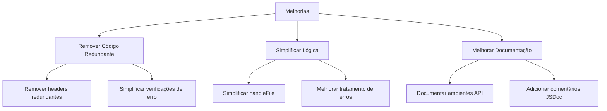

# Análise de Código e Melhorias Propostas

## 1. Componentes do Sistema



## 2. Código Não Utilizado e Melhorias

### 2.1 UI.js
- O método `preventDefaults()` está sendo usado apenas internamente
- Mensagens de console em `handleFile()` não são visualizadas pelo usuário
- Parâmetro `mode` em `handleFile()` usado apenas para seleção condicional

### 2.2 API.js
- Header 'Accept': 'application/json' redundante
- Modo 'cors' explícito desnecessário
- Verificação dupla de erros pode ser simplificada

### 2.3 Config.js
Atual implementação:
```javascript
export const API_URL = window.location.hostname === 'localhost' || window.location.hostname === '127.0.0.1'
    ? 'http://127.0.0.1:5000'
    : 'https://steganografia-api.onrender.com';
```

Proposta de melhoria com documentação:
```javascript
/**
 * Configuração das URLs da API para diferentes ambientes
 * 
 * Ambientes suportados:
 * - Local: localhost ou 127.0.0.1 (porta 5000)
 * - Dev: ambiente de desenvolvimento (dev-steganografia-api.onrender.com)
 * - Staging: ambiente de testes (staging-steganografia-api.onrender.com)
 * - Prod: ambiente de produção (steganografia-api.onrender.com)
 */
export const API_URL = (() => {
    const hostname = window.location.hostname;
    
    // Ambiente local
    if (hostname === 'localhost' || hostname === '127.0.0.1') {
        return 'http://127.0.0.1:5000';
    }
    
    // Ambiente de desenvolvimento
    if (hostname.startsWith('dev.')) {
        return 'https://dev-steganografia-api.onrender.com';
    }
    
    // Ambiente de staging
    if (hostname.startsWith('staging.')) {
        return 'https://staging-steganografia-api.onrender.com';
    }
    
    // Ambiente de produção (default)
    return 'https://steganografia-api.onrender.com';
})();
```

## 3. Plano de Melhorias



## 4. Priorização das Melhorias

1. **Alta Prioridade**
   - Melhorar documentação dos ambientes na config.js
   - Simplificar verificações de erro no API.js

2. **Média Prioridade**
   - Simplificar método handleFile
   - Remover headers redundantes

3. **Baixa Prioridade**
   - Refatorar preventDefaults
   - Remover console.logs não utilizados

## 5. Próximos Passos

1. Implementar melhorias de alta prioridade
2. Realizar testes para garantir que as mudanças não causaram regressões
3. Documentar todas as alterações realizadas
4. Avaliar impacto das melhorias e coletar métricas