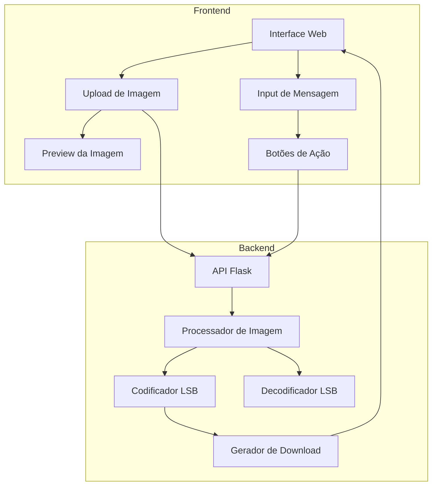

# Plano de Implementação - Aplicação de Esteganografia

## Visão Geral
Este documento contém o plano detalhado para implementação de uma aplicação web de esteganografia utilizando a técnica LSB (Least Significant Bit), com frontend em HTML/CSS/JavaScript e backend em Flask/Python.

## Arquitetura do Sistema



## 1. Estrutura do Projeto

```
steganography/
├── backend/
│   ├── app.py
│   ├── requirements.txt
│   └── utils/
│       ├── __init__.py
│       ├── encoder.py
│       └── decoder.py
├── frontend/
│   ├── index.html
│   ├── styles/
│   │   └── main.css
│   └── scripts/
│       └── main.js
└── README.md
```

## 2. Componentes Principais

### Backend (Flask + Python)

#### 2.1 API Endpoints:
- `POST /encode` - Recebe imagem e mensagem, retorna imagem codificada
- `POST /decode` - Recebe imagem, retorna mensagem oculta
- `GET /health` - Endpoint de verificação de saúde da API

#### 2.2 Processamento de Imagem:
- Utilização da biblioteca Pillow para manipulação de imagens
- Implementação do algoritmo LSB para codificação/decodificação
- Validação de formatos de arquivo e tamanhos

### Frontend (HTML/CSS/JavaScript)

#### 2.3 Interface do Usuário:
- Design responsivo e minimalista
- Duas seções principais: codificação e decodificação
- Preview de imagem em tempo real
- Feedback visual durante o processamento

#### 2.4 Funcionalidades JavaScript:
- Validação client-side de arquivos
- Requisições assíncronas para API
- Manipulação do DOM para feedback
- Gerenciamento de download da imagem processada

## 3. Implementação Técnica

### Fase 1: Setup Inicial
1. Configuração do ambiente Flask
2. Estruturação dos diretórios
3. Implementação do esqueleto da API

### Fase 2: Backend
1. Implementação do algoritmo LSB
2. Desenvolvimento das rotas da API
3. Testes unitários básicos

### Fase 3: Frontend
1. Desenvolvimento da interface HTML/CSS
2. Implementação da lógica JavaScript
3. Integração com a API

### Fase 4: Integração e Testes
1. Testes de integração
2. Otimizações de performance
3. Tratamento de erros

## 4. Deploy

### 4.1 Backend:
- Deploy no Render
- Configuração de variáveis de ambiente
- Setup do CORS para integração com frontend

### 4.2 Frontend:
- Deploy no GitHub Pages ou Netlify
- Configuração de variáveis de ambiente para URL da API

## 5. Documentação

### 5.1 README.md:
- Instruções de instalação
- Guia de uso
- Explicação do funcionamento da esteganografia
- Requisitos do sistema
- Instruções de deploy

### 5.2 Documentação Técnica:
- Descrição da API
- Fluxo de dados
- Limitações conhecidas

## Especificações Técnicas Adicionais

### Formatos de Imagem Suportados:
- PNG (preferencial)
- JPG
- BMP

### Limitações:
- Sem limite específico de tamanho para imagens
- Sem limite fixo para tamanho das mensagens
- Suporte a múltiplos formatos de imagem comuns